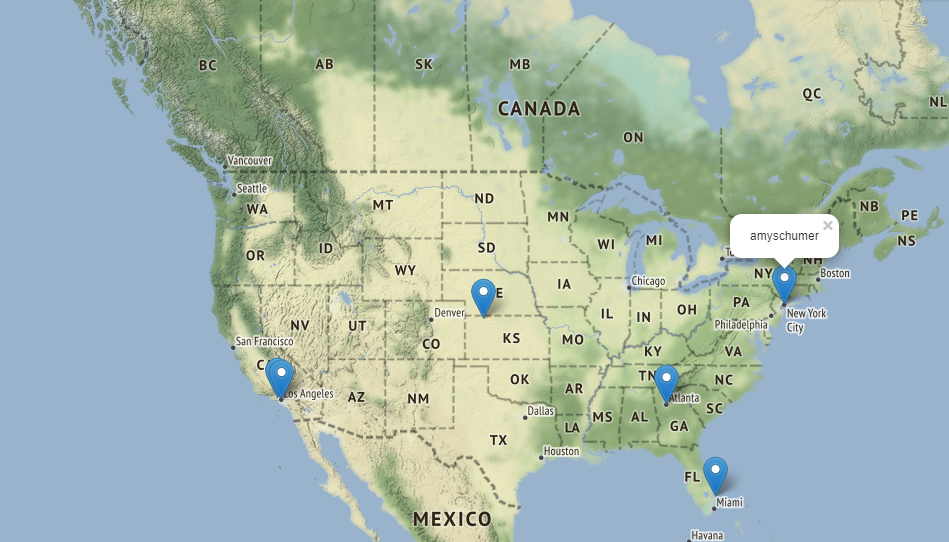

### web_map_with_friends

This web site is used to find locations of user’s friends in Twitter. On this web page you have to enter the name of the user of Twitter and wait until the map is generated. Оn the map are markers on the appropriate locations and when you click on them you can see “screen_name” of the users that live there. If the username is entered incorrectly, the following information “Such account does not exist!“ is displayed.

### Prequisities
Modules folium, flask, geopy have to be installed.

### Examples of website's work

### Conclusion
This web site helps to find the location of the Twitter users. 

### Author 
Khristina Kokolus
